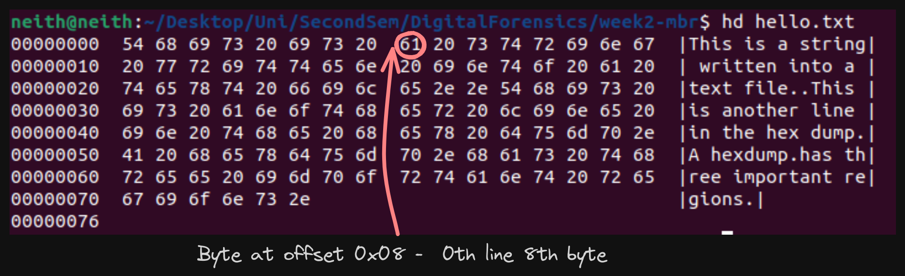
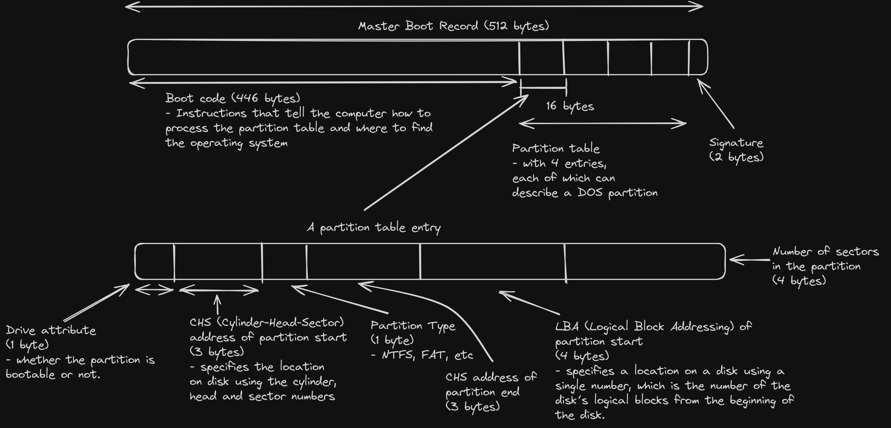

## Interpreting hex dumps

### Hex dumps

A hex dump has three regions

1. Offset column - The address or the position of the first byte in each line. Represented in hexadecimal format.
2. Hexadecimal column - The data represented in a hexadecimal format. Each pair of digits = one byte of data.
3. ASCII column - ASCII representation of the data. Non-printable characters are represented as dots (.).

### Viewing data as hex dumps

1. To interpret the hex dump the tool `hexdump` can be used.
2. Extract the byte at offset 0x08
   - `hd -n 1 -s 0x08 hello.txt`
   - `-n 1` is the length of the bytes that should be extracted
   - `-s 0x08` is the offset
     
3. Extract the 2 bytes at offset 0x43.
   - `hd -n 2 -s 0x43 hello.txt`

### Viewing data in the MBR

The file `MBR_WS.dd` is a hex dump of the master boot record.

- A disk that is organized using DOS partitions, has a master boot record in the **first 512 bytes**.
  

#### Offsets

1. MBR - 0x00
2. Partition type - 0x04
3. Number of sectors - 0x0C

## Interpreting data from the hex dump

1. Getting the bootcode in the MBR
   - `hd -n 446 -s 0x00 MBR_WS.dd`
2. The partition type
   - `hd -n 1 -s 0x04 MBR_WS.dd`
   - Gave me the output `00`, which apparently means an unused partition.
3. Number of sectors in the partition
   - `hd -n 4 -s 0x0C MBR_WS.dd`
