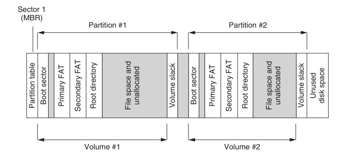

## Fat File System

### Boot sector hex dump

- Boot sector is the first sector (512 bytes) in a partition.
  

1. Extracting the boot sector from the fat file system partition image.
   - `dd if=fat16.dd of=boot-sector.dd bs=1 count=512 status=none | xxd`
2. OEM name
   - `hd -s 0x03 -n 8 boot-sector.dd`
   - Output: `mkdosfs`
3. Size of a sector
   - `hd -n 2 -s 0x0B boot-sector.dd`
   - Output: `00 02`
   - output should be turned from little endian to big endian
   - 00 02 = 0x200 = 512 bytes
4. Number of sectors
   - `hd -n 1 -s 0x0D boot-sector.dd`
   - Output: `04` = 4 sectors
5. No of reserved sectors
   - `hd -n 2 -s 0x0E boot-sector.dd`
   - Output: `04 00` -> LE to BE -> 4 = 4 sectors
6. No of FAT tables
   - `hd -n 1 -s 0x10 boot-sector.dd`
   - Output = `02` = 2 sectors
7. No of files in the root directory
   - `hd -n 2 -s 0x11 boot-sector.dd`
   - Output = 00 02 -> LE to BE -> 0x200 = 512 entries
   - Size of the root directory = no of entries x size of an entry
     = 512 x 32 = 16384 bytes
8. Total no of sectors (total size of file system)
   - `hd -n 2 -s 0x13 boot-sector.dd`
   - Output = 00 80 -> LE to BE -> 0x8000 = 32768 sectors
   - Total size = 32768 x 512 bytes = 16 MB
9. No of sectors in each FAT (size of a FAT table in sectors)
   - `hd -n 2 -s 0x16 boot-sector.dd`
   - Output = 20 00 -> LE to BE -> 0x0020 = 32 sectors

### Root directory hex dump

#### Extracting the FAT table

From inspecting the boot sector, it was found that the reserved area has 4 sectors, so we need to skip those 4 sectors to get to the FAT table.
The size of the FAT table is 32 sectors.

`dd if=fat16.dd of=fat-table.dd bs=512 skip=4 count=32`
\*Note that bs=512 here, since each sector = 512 bytes

- FAT table contains two byte pairs representing each cluster in the data area.
- The first 4 bytes are reserved, so we don’t use them for our purposes.
- Beyond that point, each pair represents a cluster and the cluster numbering starts with 2.
- For example, consider the FAT table we extracted.
  
- The initial 4 bytes are (f8ff ffff) not considered.
- The next 2 bytes (0000) represent cluster 2.
- The next 2 bytes (ffff) represents cluster 3.
- The cluster 8 is represented by the two bytes with the value 0900

#### Extracting the root directory

- The root directory is basically a large table with entries.
- Each entry represents a particular file or a directory that resides directly under the root directory of the file system.
- Each entry is 32 bytes in size.
- By interpreting the attributes in an entry, we can find out all the required informtion to retrieve a particular file represented by that entry.
- Some entries may represent a directory that is located under the root directory.
- In that case, the details points to some data blocks in the file system where another similar directory data structure is stored; we have to retrieve that directory structure and interpret its entries to find out the files located under that directory

- Root directory is located after the FAT tables. **That means, we have to calculate the entire length of the reserved area and FAT tables to find the offset to the root directory.**
- Offset to root directory = (reserved space) + (FAT table size)×(number of FAT tables)
- **Offset to root directory = (4 sectors) + (32 sectors) × 2 = 68 sectors**
- The size of the root directory was calculated when we interpret the boot sector; the value is 32 sectors.

1. `dd if=fat16.dd of=root-dir.dd bs=512 skip=68 count=32`

### Retrieving file content

- According to FAT table, the entry for cluster 3 has the value ffff indicating that there are no more clusters for this file.
- So, we only have to go and look for the cluster 3 inside the file sytem to retrieve the data of that file.
- The data area starts after the root directory in the FAT partition.
- Offset to the data area = (offset until the root directory) + (root directory size)
- **Offset to the data area = 68 sectors + 32 sectors = 100 sectors**
- Within the data area, we are handling things in clusters and a cluster is equal to 4 sectors (as we found from the boot sector).
- Cluster numbering starts with 2 within the data area. That means, cluster 3, which we are looking for is actually located at the second cluster in the data area.

`dd if=fat16.dd of=file-data.dd bs=512 skip=104 count=4`
